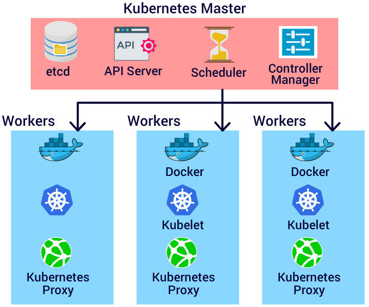

# MiniKube
## What is Minikube?
- Minikube is a light weight version of Kubernetes that can run on a local machine or a local VM.
- It is used for learning, evaluation and development purpose only.
- Minikube has an actual Kubernetes code, hence it runs all the Kubernetes CLI commands.
- Minikube cluster has only one Master and one worker node.
## Kubernetes Architecture
<!--  -->
## App Management commands
- ``autoscale`` - This command creates an autoscaler that automatically decides the number of pods that run in a kubernetes cluster.

- ``create`` - The create command is used to create Kubernetes objects from the corresponding YAML or JSOn file.

- ``delete`` - Deletes Objects by file name, stdin, resource and names.

- ``edit`` - Edits a resource from the default editor.

- ``get`` - The get command gets specific resources or objects fromthe Kubernetes and displays them


## Installing Kubectl
````
$sudo apt-get update
$sudo apt-get install apt-transport-https
````
```
$curl -s https://packages.cloud.google.com/apt/doc/apt-key.gpg | sudo apt-key add -
```
```
$sudo touch /etc/apt/sources.list.d/kubernetes.list
```
```
$echo "deb http://apt.kubernetes.io/ kubernetes-xenial main" | sudo tee -a /etc/apt/sources.list.d/kubernetes.list
```
```
$sudo apt-get update
$sudo apt-get install -y kubectl
```

## installing MiniKube
```
curl -Lo minikube https://storage.googleapis.com/minikube/releases/v0.28.1/minikube-linux-amd64
```
```
chmod +x minikube
```
```
sudo mv minikube /usr/local/bin/
```

## Componentes maestro
- ``kube-scheduler``: El kube-scheduler asigna pods recién creados a nodos trabajadores disponibles en Kubernetes. Considera factores como requisitos de recursos, capacidad de nodos, localidad de datos y políticas para distribuir cargas de trabajo de manera eficiente.
    - Requisitos y disponibilidad de recursos
    - Localidad de datos
    - Restricciones de políticas de hardware/software
    - Plazos o fechas límite

- ``kube-controller-manager:``El kube-controller-manager es un componente central del plano de control de Kubernetes que mantiene el estado deseado del clúster. Está compuesto por varios controladores, como el node controller, Replication controller, endpoints controller y service account/token controller, que gestionan diferentes aspectos del clúster para mantener su funcionamiento según la configuración y las políticas definidas.

- ``kube-apiserver:`` El kube-apiserver es el componente principal que se conecta a la API de Kubernetes para ejecutar tareas administrativas solicitadas por los usuarios. Después de completar las operaciones, almacena el estado del clúster en etcd, un almacén de clave-valor. Funciona como la interfaz frontal en el plano de control de Kubernetes y puede escalar horizontalmente aumentando el número de instancias para manejar cargas de trabajo más pesadas.

- ``etcd:`` etcd es un almacén de clave-valor altamente confiable y distribuido utilizado para almacenar el estado del clúster en Kubernetes. Puede integrarse como parte del nodo maestro o como un componente externo, permitiendo que el nodo maestro acceda y actualice el estado del clúster de manera coherente y segura.

- ``kubelet`` El kubelet es un componente del nodo trabajador que se ejecuta en cada nodo trabajador de un clúster de Kubernetes y se utiliza para comunicarse con el nodo maestro. Su función principal es ejecutar contenedores dentro de un pod según la especificación del pod. La especificación del pod es un archivo YAML o JSON que contiene información sobre qué contenedores se deben ejecutar en el pod.

- ``kube-proxy`` kube-proxy es un servicio de proxy de red de Kubernetes que se ejecuta en cada nodo del clúster. Se utiliza para conectar las aplicaciones con el mundo o entorno externo. En lugar de conectarse directamente a los pods para interactuar con las aplicaciones, se utilizan servicios. Un servicio agrupa pods relacionados y se utiliza para el equilibrio de carga TCP y UDP.

- ``Container Runtime`` Cada contenedor necesita un tiempo de ejecución específico, como Docker o rkt, para ser creado y ejecutado en un nodo. El kubelet se comunica con este tiempo de ejecución a través de la Interfaz de Tiempo de Ejecución de Contenedor (CRI), que gestiona las imágenes de contenedor y la ejecución de los contenedores dentro de un pod en el nodo.

- ``Nodos en Kubernetes`` Los nodos son las máquinas trabajadoras en un clúster de Kubernetes que son controladas y gestionadas por el Maestro. Pueden ser máquinas locales o máquinas virtuales (VMs) y contienen Pods, que son las unidades básicas de ejecución en Kubernetes. Las funciones proporcionadas por los nodos incluyen:

- ``Estado del Nodo:`` Contiene información vital sobre el nodo, como direcciones y condiciones de funcionamiento.
  - ``Direcciones:``
    - ``Nombre de Host (Hostname):`` Proporcionado por el kernel del host del nodo.
    - ``IP Externa (External IP):`` La dirección IP utilizada para comunicarse con el nodo fuera del clúster.
    - ``IP Interna (Internal IP):`` La dirección IP utilizada para la comunicación dentro del clúster.
  - ``Condición (Condition):`` Describe el estado actual de los nodos en ejecución.
  - ``Capacidad (Capacity):`` Describe los recursos disponibles en los nodos y el número máximo de pods que pueden programarse en el nodo.
  - ``Información Adicional (Info):`` Proporciona información genérica sobre el nodo, como la versión del kernel, versión de Kubernetes (kubelet y kube-proxy), versión de Docker (si se utiliza) y nombre del sistema operativo. Esta información es recopilada por Kubelet desde el nodo.

## Kubectl Commands
- ``version`` - Print the client an``d server version information for the current context
- ``config`` - Modify kubeconfig files using subcommands and seeing the connection details
- ``run`` - Creates a deployment or job to manage the created container(s).
- ``expose`` - Searches for a deployment, service, replica set, replication controller or pod by name and uses the selector for that resource as the selector for a new service on the specified port.
- ``label`` - Update the labels of Kubernetes Objects
- ``replace`` - Replace a resource by filename or stdin. It uses YAML or JSON filesto replace the existing resources
- ``rolling-update`` - Perform a rolling update of the given ReplicationController.
- ``rollout`` - Manage the rollout of a resource.Valid resource types include:
    - deployments
    - daemonsets
    - statefulsets
- ``scale`` - Set a new size for a Deployment, ReplicaSet, Replication Controller, or StatefulSet. Scale also allows to specify the conditions when the scaling should take place.
- ``set`` - Configure application resources. These commands help you make changes to existing application resources.
- ``attach`` -is used to attch the object to a process that is already running inside an existing container.
- ``cp`` - Copy files and directories to and from containers.
- ``describe`` - Describes the specified Kubernetes resource.
- ``exec`` - Execute a command in a container.
- ``logs`` - Print the logs for a container in a pod or specified resource. If the pod has only one container, the container name is optional.
- ``proxy`` - Creates a proxy server or application-level gateway between the external world and Kubernetes API server.
- ``top`` - Display Resource (CPU/Memory/Storage) usage.
- ``api-versions ``- Print the supported API versions on the server, in the form of "group/version"
- ``cluster-info`` - Display addresses of the master and services with label kubernetes.io/cluster-service=true To further debug and diagnose cluster problems, use 'kubectl cluster-info dump'.
- ``drain`` - Drain node of all its resources like pods, services,etc for maintenance.
- The ``kubectl proxy`` command authenticates the Kubernetes API server on the Master node.